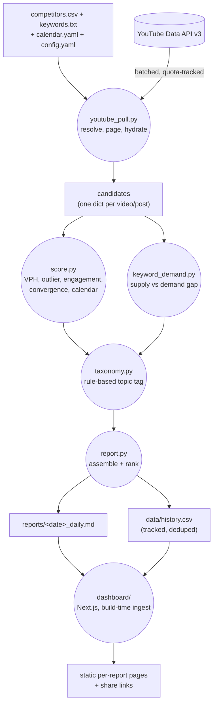

# yt-competitor-swipe

Daily competitive intelligence for a YouTube niche. Point it at a handful of
competitor channels and it scans everything they published in the last 24h,
scores each upload against six signals, mines the comments on the picks that
matter, and writes a ranked report plus a browsable dashboard — before a
human would have finished opening the first channel by hand.

The report says up front how long the equivalent manual sweep would have
taken. That is the pitch: this replaces roughly an hour of "open every
channel, judge every upload, read the comments" with a script that runs
before the deadline.

## What it does

1. **Pulls** every competitor channel's uploads from the last 24h (or 7 days
   for the weekly run), classifies each as short / long-form / livestream,
   and hydrates stats in batches — see `src/youtube_pull.py`.
2. **Scores** every upload 0–100 on a blend of six signals: views-per-hour,
   outlier multiple against the channel's own baseline, engagement-velocity
   z-scores, a demand/supply keyword gap, title-cluster convergence across
   competitors, and a seasonal-calendar tailwind — `src/score.py` +
   `src/keyword_demand.py`.
3. **Tags** each pick with a rule-based topic label (`src/taxonomy.py`) and
   assembles a ranked Markdown report with a one-page "read this and stop"
   summary plus full per-format sections (`src/report.py`).
4. **Ships** the report and a running ledger (`data/history.csv`) as
   committed files — the repo itself is the delivery surface, not an email
   or a spreadsheet a link can rot.
5. **Serves** it through `dashboard/`, a Next.js app that ingests the
   committed reports at build time and serves static per-report pages,
   auth-gated, with expiring share links for sending one report to someone
   outside the team.

## Architecture



Every stage reads and enriches the same in-memory candidate dict rather than
passing separate structures between modules — `youtube_pull` fills the raw
signal fields, `score` adds the ranking fields, `report` adds the narrative.
Full module-by-module ownership and the multi-vertical design (one engine,
several niches, keyed by a `VERTICAL` env var) are in
[`docs/ARCHITECTURE.md`](docs/ARCHITECTURE.md).

## The signals

| Flag | Fires when |
|---|---|
| `BREAKOUT` | A video's views-per-hour is 2x+ its own channel's expected pace |
| `CONVERGENCE` | 3+ competitors post near-identical titles on the same hook within 48h |
| `CALENDAR` | The title matches the currently-active seasonal phase in `calendar.yaml` |
| `HOT_ENGAGEMENT` | Comment velocity is 1.5+ standard deviations above the field |
| `DEMAND_GAP` | A trending keyword has thin or stale supply from any tracked channel |
| `NEW_FORMAT` | A channel posts a format it hasn't used in 30+ days |

Weights for the blended Opportunity Score live in `config.yaml`, not code —
`weights.vph`, `weights.outlier`, `weights.engagement`, `weights.demand_gap`,
`weights.convergence`, `weights.calendar`, all summing to 100. Change the
niche's priorities without touching a line of Python.

## Quickstart

```bash
git clone https://github.com/svx2027/yt-competitor-swipe.git
cd yt-competitor-swipe
python3 -m venv .venv && source .venv/bin/activate
pip install -r requirements.txt

# The repo ships a fully synthetic demo vertical (fictional home-fitness-gear
# review niche) so you can see a real report before pointing this at your
# own channels. Runs entirely offline - no API key, no network call.
python3 -m demo.build_sample_report
cat reports/*_daily.md
```

Point it at a real niche: replace `config.yaml`, `competitors.csv`,
`calendar.yaml`, `keywords.txt`, and `config/taxonomy.yml` with your own
values (or set `VERTICAL=<name>` and create `verticals/<name>/` with the
same five files), add `YT_API_KEY` to a `.env` (see `.env.example`), and run
the pull scripts against the real YouTube Data API.

## Dashboard

`dashboard/` is a separate Next.js app that reads the committed
`reports/*.md` and `data/history.csv` at build time and serves static
per-report pages behind Google or per-vertical credential auth, with
expiring share links for sending one report outside the team. It ships
wired to the same demo data as the Python engine above, plus a second
`outdoors` niche stubbed at `status: pending` to demonstrate the
multi-vertical registry. See [`dashboard/README.md`](dashboard/README.md)
for the auth paths and the verification gate its ingest script runs before
publishing a report. It is not deployed anywhere public yet — build and run
it locally with `npm install && npm run build && npm start`.

## Quota discipline

`search.list` costs 100x what every other YouTube Data API endpoint costs.
`docs/API_QUOTA.md` documents the per-endpoint unit costs, where a run's
9,000-unit budget actually goes, and the degradation ladder: a quota squeeze
narrows keyword discovery first, then comment mining, before it ever touches
the core channel scan and scoring. The core scan is never the thing that
gets skipped.

## Honest scope

- No live deployment yet — the dashboard runs locally; a hosted demo is
  planned but not live.
- Two config-referenced features aren't ported: community-post scraping and
  Gemini thumbnail-vision reads. The pipeline runs correctly without them
  (posts default to empty, thumbnail reads default to `None`) — see the
  Honest scope section of `docs/ARCHITECTURE.md` for exactly what's
  configured-but-not-built.
- Only daily and weekly reports are implemented; a monthly retro is
  configured in `config.yaml` but not yet built.
- Title clustering falls back to a deterministic local method when Gemini
  is unavailable or unset — the signal never depends on an external API
  being up.

## Tests

```bash
python3 -m unittest discover -s tests -v
```

66 tests covering scoring math (outlier multiples, z-scores, the demand-gap
zero-vs-missing distinction), taxonomy tagging, and report assembly —
including a regression test that spawns fresh subprocesses under different
hash seeds to confirm title-cluster labeling doesn't depend on Python's
per-process string-hash order.

## Case study

A full write-up of the design decisions and platform quirks behind this
pipeline is in progress as part of a case-study series on
[shivamvashisth.com](https://shivamvashisth.com) — not published yet. This
README and `docs/` are the source of truth in the meantime.

## Layout

```
src/          the engine: youtube_pull, score, keyword_demand, taxonomy,
              report, common (config/vertical resolution, ledger I/O)
demo/         synthetic demo data generator + its own README
dashboard/    Next.js reports dashboard, own README + .env.example
docs/         ARCHITECTURE.md, API_QUOTA.md
tests/        66 tests, no network calls
config.yaml, competitors.csv, calendar.yaml, keywords.txt,
config/taxonomy.yml    the demo vertical's config (replace for your niche)
reports/      committed daily/weekly reports
data/         data/history.csv, the tracked master ledger
```

## Related

[yt-mastersheet-kit](https://github.com/svx2027/yt-mastersheet-kit) — a
sibling YouTube-channel-tracking tool from the same tooling series, built
with the same config-driven, verify-before-deliver approach.
